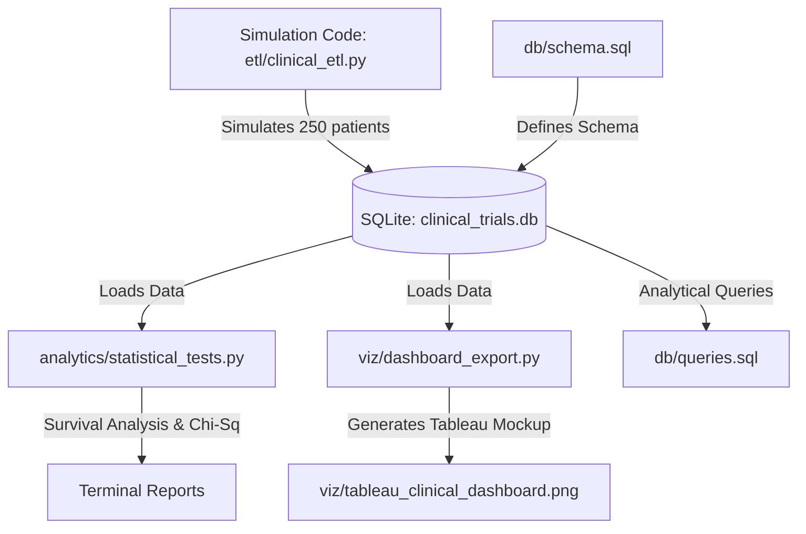

# Clinical Trials Outcomes & Efficacy Analysis Portfolio

This repository contains a modular data engineering and statistical analysis pipeline for a simulated Phase II oncology clinical trial. The project models patient demographics, longitudinal treatment logs, and clinical endpoints across three treatment arms. It also provides a premium, Tableau-style dashboard summarizing the results, along with SQL analytical queries for deeper insights.

## Table of Contents
1. [Study Protocol & Design](#study-protocol--design)
2. [Data Pipeline Architecture](#data-pipeline-architecture)
3. [Kaplan-Meier Survival Analysis](#kaplan-meier-survival-analysis)
4. [Tableau Integration Instructions](#tableau-integration-instructions)
5. [Getting Started & Installation](#getting-started--installation)
6. [Repository Structure](#repository-structure)

---

## Study Protocol & Design

### Overview
This clinical study is a Phase II, randomized, open-label, multi-center trial evaluating the safety, efficacy, and tolerability of a novel small-molecule oncology compound, **Antigrav-101**, in patients with advanced solid tumors (specifically stage III/IV non-small cell lung cancer - NSCLC).

### Study Arms
The trial enrolled **250 patients** randomized in a 1:1:1 ratio into three distinct treatment groups:
1. **Control Arm (Placebo)** ($N=84$): Patients received standard supportive care plus a matching placebo.
2. **Low-Dosage Arm (50 mg)** ($N=83$): Patients received a daily oral dose of 50 mg of Antigrav-101.
3. **High-Dosage Arm (150 mg)** ($N=83$): Patients received a daily oral dose of 150 mg of Antigrav-101.

### Baseline Demographics
To ensure validation sanity, the patient generation protocol utilizes key distributions representing an actual oncology trial demographic:
* **Age:** Average age of enrollment is $64 \pm 8$ years (range: 40–85), representing typical lung cancer onset profiles.
* **Gender:** Split roughly 52% Male and 48% Female.
* **Baseline Vital (Systolic Blood Pressure):** Monitored as a baseline safety metric ($135 \pm 12$ mmHg), representing a typical mild hypertensive demographic common in elderly oncology cohorts.

### Endpoints
* **Primary Efficacy Endpoint:** Percentage tumor volume reduction (Efficacy Score) from baseline to week 24.
* **Secondary Endpoint:** Overall Survival (OS) monitored over a 365-day study period.
* **Safety Endpoints:** Longitudinal blood pressure fluctuations to detect treatment-related hypertension ($>155$ mmHg) or hypotension ($<105$ mmHg).

---

## Data Pipeline Architecture

The data pipeline simulates realistic clinical trial metrics using statistical distributions in Python, writes them to a relational database, and exposes them for visualization:



### Relational Schema
The database uses three normalized tables designed in [schema.sql](file:///g:/Clinical-Trials-Outcomes-Analysis/db/schema.sql):
* **`patients`**: Stores baseline demographics and study group allocation.
* **`treatment_log`**: Captures longitudinal safety metrics (systolic blood pressure) and dosage tracking on designated trial days (Days 1, 30, 60, 90, ..., 360).
* **`trial_outcomes`**: Stores efficacy endpoint (percentage tumor shrinkage) and survival outcomes (overall survival days and censor indicators).

---

## Kaplan-Meier Survival Analysis

Survival analysis is critical in oncology trials because clinical data is often "censored." Censoring occurs when a patient drops out of the study, is lost to follow-up, or completes the 365-day study period without experiencing the terminal event (death).

### Kaplan-Meier Estimator
The Kaplan-Meier estimator calculates the probability of surviving past a specific point in time:
$$S(t) = \prod_{t_i \le t} \left(1 - \frac{d_i}{n_i}\right)$$
Where:
* $d_i$ is the number of events (deaths) at time $t_i$.
* $n_i$ is the number of patients at risk just before time $t_i$.

### Statistical Differences (Log-Rank Test)
The log-rank test is a non-parametric hypothesis test used to compare the survival distributions of the treatment groups:
* **Null Hypothesis ($H_0$):** There is no difference in the probability of survival between the treatment arms.
* **Alternative Hypothesis ($H_1$):** There is a statistically significant difference in survival between at least two treatment arms.

**Results of the Log-Rank Test on our simulated dataset:**
* **Control vs. High-Dosage:** $p < 0.0001$ (highly significant survival benefit).
* **Control vs. Low-Dosage:** $p < 0.0001$ (highly significant survival benefit).
* **Low-Dosage vs. High-Dosage:** $p < 0.001$ (statistically significant dosage-dependent survival benefit).

---

## Tableau Integration Instructions

To build interactive dashboards in Tableau using these clinical outcomes, follow these steps:

### Step 1: Connect to the SQLite Database
1. Launch **Tableau Desktop**.
2. Under "Connect -> To a Server", click **More...** and select **Other Databases (ODBC)**.
3. In the ODBC dialog, select **Driver**: **SQLite3 ODBC Driver** (install it first if not present).
4. Click **Connect** and browse to locate the SQLite database file: `data/clinical_trials.db`.
5. Click **OK** and **Sign In**.

### Step 2: Establish Data Model Relationships
In the Tableau Data Source interface, join the tables using a relational star or snowflake arrangement:
1. Drag the `patients` table onto the canvas.
2. Drag `trial_outcomes` and relate it using `patient_id` = `patient_id` (1:1 Relationship).
3. Drag `treatment_log` and relate it using `patient_id` = `patient_id` (1:Many Relationship).

### Step 3: Create the Dashboard Elements
* **KM Survival Curves (Tableau workaround):**
  1. Drag `Survival Days` to the Columns shelf (continuous dimension).
  2. Create a Calculated Field `Cumulative Survival Rate` using running table calculations.
  3. Drag `Group Name` to the Color card.
  4. Drag `Event Observed` to the detail shelf to distinguish event types.
* **Vitals Over Time:**
  1. Drag `Trial Day` to Columns.
  2. Drag `Vitals Measured` to Rows (set to Average).
  3. Drag `Group Name` to Color.
* **Efficacy Scatter:**
  1. Drag `Age` to Columns.
  2. Drag `Efficacy Score` to Rows.
  3. Drag `Group Name` to Color and `Patient ID` to Detail.
  4. Add a linear trend line.

---

## Getting Started & Installation

### Prerequisites
* Python 3.8 or higher
* Pip (Python Package Installer)

### Installation
1. Clone this repository to your local system.
2. Install the required libraries:
   ```bash
   pip install -r requirements.txt
   ```

### Execution Workflow
1. **Run ETL Pipeline:** Simulates raw patient data, formats schemas, and writes records into the SQLite database.
   ```bash
   python etl/clinical_etl.py
   ```
2. **Run Statistical Analysis:** Executes survival analysis, performs log-rank and Chi-square tests, and prints results to stdout.
   ```bash
   python analytics/statistical_tests.py
   ```
3. **Export Dashboard viz:** Exports a premium Matplotlib static mockup representing the target Tableau dashboard.
   ```bash
   python viz/dashboard_export.py
   ```

---

## Repository Structure

```
Clinical-Trials-Outcomes-Analysis/
│
├── README.md                           # Study protocol, statistical background, & Tableau guide
├── requirements.txt                    # List of required python libraries
│
├── db/
│   ├── schema.sql                      # SQL database schema definitions
│   └── queries.sql                     # 6 analytical queries for database analysis
│
├── data/
│   └── clinical_trials.db              # SQLite Database generated by clinical_etl.py
│
├── etl/
│   └── clinical_etl.py                 # Core simulation and data pipeline script
│
├── analytics/
│   └── statistical_tests.py            # Kaplan-Meier survival curves and hypothesis tests
│
└── viz/
    ├── dashboard_export.py             # Matplotlib dashboard generation script
    └── tableau_clinical_dashboard.png  # Generated premium analytics mockup
```
